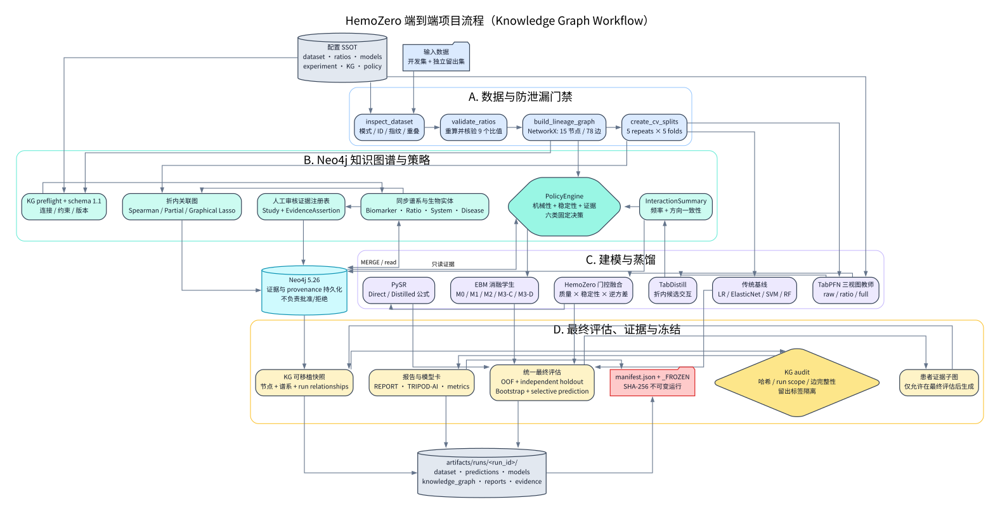
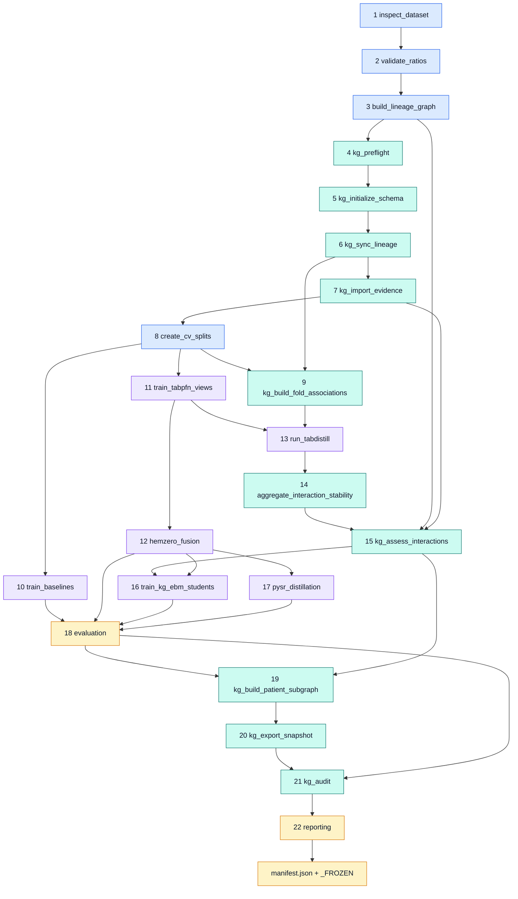

# HemoZero 项目说明

> 文档状态：依据 2026-07-20 的仓库代码、配置、Neo4j 在线实例和冻结运行制品整理。
> 项目定位：使用 6 项实测血液生物标志物及其 9 项确定性比值，对 `Anxiety_14` 进行小样本二分类研究。
> 使用边界：这是研究与方法验证系统，不是临床诊断工具；现有数据和性能不足以支持临床部署或因果结论。

## 1. 项目概览

HemoZero 不是单一分类器，而是一套“数据谱系感知的多视图血液建模引擎”。它把同一位受试者的血液指标拆成原始指标、派生比值和完整特征三个视图，使用 TabPFN 分别建模，再根据样本质量和预测稳定性进行门控融合。同时，系统用 NetworkX 计算确定性特征谱系，用 Neo4j 持久化生物实体、候选交互、折内关联、模型运行和审核证据，由 PolicyEngine 作最终交互决策，并通过 EBM 和 PySR 生成可审查的学生模型或显式公式。

项目的五个设计目标是：

1. **避免数据泄漏**：开发集与独立留出集分离，留出集标签只允许在最终评估阶段读取。
2. **保留特征来源**：明确记录每个比值由哪些原始指标计算得到，防止把机械关系误当成生物学交互。
3. **量化预测不确定性**：综合视图分歧、重复预测方差和数据分布偏移，提供拒判建议。
4. **保证实验可追溯**：每个阶段输出结构化证据，成功运行最终生成 SHA-256 清单并冻结。
5. **分离知识与决策权限**：Neo4j 保存事实和 provenance，不自行批准或拒绝交互；六类决策由版本化 PolicyEngine 规则产生。

## 2. 数据集

### 2.1 数据文件与主数据源

当前运行输入由 [`configs/dataset.yaml`](../configs/dataset.yaml) 指定。该配置目前指向 336 例原始开发集，并显式标记为允许精确特征向量重叠的敏感性运行；它不是首选的无泄漏主分析配置。

| 文件 | 作用 | 样本数 | 是否进入当前主流程 |
|---|---|---:|---|
| `dataset/dataset/anxiety_train.csv` | 当前配置的原始敏感性开发集 | 336 | 是；含 96 个与留出集完全相同的 15 维特征向量 |
| `dataset/dataset/anxiety_test.csv` | 固定留出集 | 145 | 是；标签只允许在最终评估读取 |
| `dataset/processed/hemozero_kg_20260719/anxiety_train_leak_free.csv` | 删除上述 96 个重叠向量后的开发集 | 240 | 推荐用于无精确复制的主分析 |
| `dataset/processed/hemozero_kg_20260719/anxiety_test_unchanged.csv` | 与清洗开发集配套的未改动留出集 | 145 | 推荐主分析的最终评估输入 |
| `dataset/origin/xueye_shiwu.csv` | 481 例完整队列追溯文件 | 481 | 不由当前训练配置直接读取 |

仓库中不得跨目录拼接或静默替换数据。运行清单记录实际输入哈希；任何输入切换都必须产生新的 `run_id`。当前保留两次完整 KG 运行：`hemozero-kg-dataset-20260719` 使用 240 例去重开发集，`hemozero-kg-raw336-20260719` 使用 336 例原始开发集并将 96 个精确重叠作为用户授权的敏感性条件记录。

### 2.2 样本与标签分布

| 数据分区 | 总例数 | `Anxiety_14=0` | `Anxiety_14=1` | 阳性率 | 缺失值 | 重复 ID |
|---|---:|---:|---:|---:|---:|---:|
| 完整队列 | 481 | 298 | 183 | 38.05% | 0 | 0 |
| 去重开发集（主分析） | 240 | 160 | 80 | 33.33% | 0 | 0 |
| 原始开发集（敏感性分析） | 336 | 208 | 128 | 38.10% | 0 | 0 |
| 独立留出集 | 145 | 90 | 55 | 37.93% | 0 | 0 |

数据审计确认：

- 两种配置的开发集和留出集之间 `CaseNumber` 重叠均为 0；
- 去重开发集与留出集之间完全相同的 15 维特征向量重叠为 0；原始敏感性开发集则存在 96 个精确重叠，并在运行证据中显式授权；
- 开发集全部数值列不存在 `NaN`、`+Inf` 或 `-Inf`；
- 原始敏感性运行中 9 个比值 × 336 个开发样本共 3,024 次公式校验全部通过，容差为 `1e-6`，没有近零分母。

### 2.3 字段定义

| 类别 | 字段 | 在模型中的用途 |
|---|---|---|
| 样本标识 | `CaseNumber` | 受试者/病例 ID；用于拆分、关联和重复检查，不作为特征 |
| 预测目标 | `Anxiety_14` | 二分类标签；仓库历史说明中 `1` 表示焦虑阳性 |
| 排除变量 | `Chronic_pain`, `Depression_18` | 数据中保留，但明确排除，避免模型借用共病标签 |
| 炎症相关原始指标 | `IL6`, `IL10`, `TNFalpha`, `CRP` | 原始视图的一部分 |
| HPA 轴相关原始指标 | `ACTH`, `CORT` | 原始视图的一部分 |
| 派生比值 | 见下表 9 项 | 比值视图的一部分，由原始指标确定性重算 |

仓库目前没有给出检测单位、采样时点、检测方法、纳入/排除标准、队列来源、`Anxiety_14` 的量表及阈值定义，也没有人口学变量说明。正式论文、数据卡或对外共享材料必须先补齐这些信息。除字段名所表达的通常生物学含义外，本项目文档不对单位和临床含义作额外推断。

### 2.4 原始指标范围

下表是 481 例完整队列的描述性范围，仅用于数据识别和异常排查；由于单位未记录，不应据此做临床阈值解释。

| 指标 | 最小值 | 中位数 | 最大值 |
|---|---:|---:|---:|
| `IL6` | 0.75 | 1.63 | 19.30 |
| `IL10` | 0.02 | 1.7816 | 45.64 |
| `TNFalpha` | 0.05 | 1.0609 | 15.67 |
| `CRP` | 0.4297 | 1.86 | 77.80 |
| `ACTH` | 0.50 | 17.88 | 117.10 |
| `CORT` | 0.75 | 257.00 | 671.00 |

### 2.5 九项确定性比值

比值公式由 [`configs/ratio_formulas.yaml`](../configs/ratio_formulas.yaml) 管理。运行时不会盲目信任 CSV 中已有的比值，而是从 6 个原始指标重新计算并与原值比较。

| 派生特征 | 公式 | 共享来源示例 |
|---|---|---|
| `IL6/IL10` | `IL6 ÷ IL10` | 与另外多个 IL6 或 IL10 比值共享分量 |
| `TNFalpha/IL10` | `TNFalpha ÷ IL10` | 与 `IL6/IL10` 共享 IL10 |
| `CRP/IL10` | `CRP ÷ IL10` | 与 `TNFalpha/IL10` 共享 IL10 |
| `CORT/ACTH` | `CORT ÷ ACTH` | HPA 轴内部比值 |
| `CORT/IL6` | `CORT ÷ IL6` | 跨 HPA 轴与炎症指标 |
| `CORT/CRP` | `CORT ÷ CRP` | 跨 HPA 轴与炎症指标 |
| `IL6/TNFalpha` | `IL6 ÷ TNFalpha` | 炎症指标内部比值 |
| `CRP/IL6` | `CRP ÷ IL6` | 炎症指标内部比值 |
| `ACTH/IL6` | `ACTH ÷ IL6` | 跨 HPA 轴与炎症指标 |

## 3. 当前 HemoZero 血液引擎

### 3.1 数据桥与多视图

`hematological_bridge()` 完成比值重算、容差校验和视图构建，输出三个相互关联的特征空间：

| 视图 | 输入维数 | 内容 | 目的 |
|---|---:|---|---|
| `raw` | 6 | 6 项实测血液指标 | 保留最直接、最少派生的生物标志物信号 |
| `ratio` | 9 | 9 项确定性比值 | 表达指标间相对关系 |
| `full` | 15 | 原始指标 + 比值 | 提供完整候选信息，同时承担较高的共线和机械冗余风险 |

### 3.2 特征谱系与交互过滤

NetworkX `MultiDiGraph` 把 6 个原始指标标为 `raw` 节点，把 9 个比值标为 `derived` 节点，并记录：

- `numerator_of`：某原始指标是比值的分子；
- `denominator_of`：某原始指标是比值的分母；
- `derived_from`：派生关系；
- `shared_component`：两个比值共享同一原始指标。

当前图包含 15 个节点和 78 条多重有向边。图不是 DAG，因为共享分量关系是双向边。TabDistill 给出候选交互后，过滤器会拒绝同一特征、直接推导关系、共享组成分量、频率不足或方向不稳定的交互，并把最终交互数量限制为最多 2 个。

### 3.3 TabPFN 三视图教师模型

每个外层验证折内分别对 `raw`、`ratio`、`full` 训练真实 TabPFN 分类器。当前配置为 CPU、4 个 ensemble/prediction seeds、低内存模式；如果 TabPFN 包、模型授权或缓存不可用，阶段会明确阻塞，禁止用其他估计器冒充 TabPFN。

每个视图输出三个核心量：

- 阳性概率 `p`；
- 多个预测成员之间的方差 `σ²`；
- 门控分数 `g = data_quality_gate × stability_gate`。

数据质量门控由相对训练分布的稳健距离、是否超出训练范围和缺失率组成；稳定性门控随预测方差增大而指数下降。

### 3.4 HemoZero 门控精度融合

HemoZero 的主输出不是简单平均，而是在 logit 空间进行门控逆方差加权。对样本 `i` 和视图 `v`：

```text
w(i,v) = g(i,v) / (variance(i,v) + epsilon)
z(i)   = sum_v[w(i,v) * logit(p(i,v))] / sum_v[w(i,v)]
P(i)   = sigmoid(z(i))
```

当前 `epsilon=1e-4`。系统同时保留简单平均、无门控精度融合和交叉拟合逻辑回归 stacking 作为融合对照，便于判断门控机制是否真正带来收益。

### 3.5 不确定性与拒判

不确定性来自三类信号：

- 三个视图的概率标准差，即视图分歧；
- TabPFN ensemble 成员的预测方差；
- 5 次外层重复验证之间的预测标准差与分类翻转率。

最终 `uncertainty_score` 取视图分歧与预测不稳定性的较大值。单次结果中最高 10% 不确定样本会标记 `abstain_recommended=true`；评估报告还比较 0%、5%、10%、20% 拒判比例下的保留样本性能。该标记目前是研究用选择性预测信号，不是临床处置规则。

### 3.6 可解释学生模型

系统包含两条解释性蒸馏路线：

1. **TabDistill → PolicyEngine → EBM**：每个外层训练折内用 TabPFN 教师提取多种谱交互指数（`fbii`、`fsii`、`stii`、`bii`、`sii`、`fourier`、`mobius`），汇总为 `InteractionSummary`，再结合 NetworkX 谱系、稳定性和 Neo4j 审核证据形成六类决策，训练 M0、M1、M2、M3-C 和 M3-D 五个消融学生模型。
2. **HemoZero → PySR**：仅从 6 个原始指标中选择最多 4 项，让 PySR/SymbolicRegression.jl 分别拟合真实标签的平滑概率（Direct）或 HemoZero OOF 软标签（Distilled），产生可审查的显式公式。

TabDistill 在独立子进程中运行，因为其代码库使用顶层包名 `src`，会与本项目的 `src` 布局冲突。

### 3.7 基线、验证与评估

传统基线包括逻辑回归、Elastic Net、校准 SVM 和随机森林。主实验配置为：

| 项目 | 当前值 |
|---|---:|
| 固定随机种子 | 284 |
| 外层交叉验证 | 5 repeats × 5 folds |
| 内层折数 | 4 |
| TabPFN 预测成员 | 4 |
| TabDistill 搜索 | 5 repeats × 5 folds |
| EBM 最大交互数 | 2 |
| PySR 搜索迭代 | 100 |
| Bootstrap 重采样 | 500 |
| 留出集策略 | 仅最终评估 |

报告指标包括 AUROC、AUPRC、Brier、LogLoss、Sensitivity、Specificity、F1、MCC、校准截距/斜率、Bootstrap 区间和选择性预测结果。所有 OOF 结果先在患者层面对重复预测取均值，再计算总体指标。

## 4. 整体架构图

下图是当前知识图谱工作流的端到端项目流程。SVG 可直接用于文档或演示，Graphviz 源文件可继续编辑：[`hemozero_project_flow.dot`](assets/hemozero_project_flow.dot)。



### 4.1 22 阶段执行依赖

[`configs/workflows/hemozero_kg.yaml`](../configs/workflows/hemozero_kg.yaml) 是知识图谱工作流的依赖单一事实来源。PiRunner 只调度依赖已满足的白名单工具，状态写入 `evidence/state.json`，完成后才生成总清单并冻结。



### 4.2 Neo4j schema 1.1.0

Neo4j 中的节点分为四组：

| 分组 | 节点标签 | 主要关系 |
|---|---|---|
| 生物实体 | `Biomarker`, `DerivedRatio`, `BiologicalSystem`, `Disease` | `NUMERATOR_OF`, `DENOMINATOR_OF`, `DERIVED_FROM`, `SHARES_COMPONENT`, `PARTICIPATES_IN` |
| 运行 provenance | `ModelRun`, `CVFold`, `Model` | `PART_OF_RUN`, `TRAINED_IN`, `DISTILLED_FROM`, `PREDICTS` |
| 交互决策 | `InteractionCandidate`, `InteractionSummary`, `InteractionDecision` | `LEFT_FEATURE`, `RIGHT_FEATURE`, `GENERATED_IN`, `SELECTED_BY`, `SUMMARIZES_RUN`, `DECIDES_ON` 及拒绝/支持关系 |
| 审核证据 | `Study`, `EvidenceAssertion` | `HAS_SUBJECT`, `HAS_OBJECT`, `SUPPORTED_BY` |

schema 1.1.0 新增并固化：

- `(:ModelRun)-[:PREDICTS]->(:Disease)`，把运行与 `Anxiety_14` 目标显式连接；
- `(:InteractionSummary)-[:LEFT_FEATURE|RIGHT_FEATURE]->(:FeatureEntity)`，不再只把特征对保存在字符串属性中；
- `run_relationships.jsonl` 快照导出，以及“每个 Summary 两侧特征边完整、每个运行恰好一个疾病目标”的审计检查。

特征节点同时保留稳定内部 ID、表格显示名和生物学全称。例如 `IL10` 节点保存 `id=IL10`、`display_name=IL10`、`name=Interleukin-10`；Neo4j Browser 的 GraSS 样式使用 `display_name` 作为图上标题，但完整名称仍保留为属性。

### 4.3 计算、持久化和决策边界

- **NetworkX 计算确定性谱系**：分子、分母、派生和共享分量关系只从版本化公式生成。
- **Neo4j 持久化事实**：保存实体、折内关联、候选、汇总、决策结果、模型 provenance 和人工审核证据；Neo4j 本身不是策略权威。
- **PolicyEngine 作决策**：按固定顺序综合机械性、稳定性和直接证据，输出六类状态；不使用任意“知识分数”。
- **独立留出集保持隔离**：所有候选发现、折内关联和策略决策均在开发数据内完成；留出标签只在 `evaluation` 阶段读取。
- **冻结快照可审计**：Neo4j 状态导出到 JSONL/Cypher 后进入 SHA-256 总清单；`_FROZEN` 运行不得原地续跑或修改。

知识约束扩展的详细规则和消融定义见 [`KNOWLEDGE_CONSTRAINED_DISTILLATION.md`](KNOWLEDGE_CONSTRAINED_DISTILLATION.md)。

## 5. 代码与配置分层

| 路径 | 职责 |
|---|---|
| `configs/` | 全局配置单一事实来源；代码不应硬编码数据路径、公式或实验规模 |
| `pi_agent/` | 确定性策略、状态恢复、工具注册和只读证据访问 |
| `tools/` | 参数验证、文件契约和 `ToolResult` 封装；不承载核心科学算法 |
| `src/hemzero/data/` | 数据检查、比值重算和三视图构建 |
| `src/hemzero/graph/` | 特征谱系图和机械冗余交互过滤 |
| `src/hemzero/knowledge_graph/` | Neo4j schema、参数化写入、谱系同步、证据、策略输入、快照与审计 |
| `src/hemzero/models/` | 传统基线、TabPFN 适配与校准 |
| `src/hemzero/fusion/` | 数据质量门控、稳定性门控、精度融合和不确定性 |
| `src/hemzero/distillation/` | TabDistill 适配、EBM 学生和 PySR 学生 |
| `src/hemzero/validation/` | 嵌套/重复验证、Bootstrap、稳定性与指标 |
| `src/hemzero/reporting/` | 制品、证据、图表、表格、模型卡和论文材料 |
| `taskweaver_project/` | 可选的 LLM 对话界面；通过插件调用受控工具，不直接实现算法 |
| `configs/workflows/hemozero_kg.yaml` | 当前 22 阶段知识图谱工作流的依赖图 |
| `docs/assets/` | 项目流程图的 Graphviz 源文件及渲染后的 SVG/PNG |
| `artifacts/runs/<run_id>/` | 每次运行独立的输入快照、预测、模型、公式、报告和审计证据 |

## 6. 参考与集成项目

下表区分了“参考项目提供什么”和“HemoZero 实际怎样使用”，避免把外部能力误认为本项目原创实现。

| 项目 | HemoZero 借鉴/使用的能力 | 本项目中的落点 |
|---|---|---|
| [Prior Labs TabPFN](https://github.com/PriorLabs/TabPFN) | 小样本表格数据基础模型 | 三个特征视图的教师模型；当前运行证据标识后端为 `TabPFN-3` |
| [Clouddelta TabDistill](https://github.com/Clouddelta/tab-distill) | 从基础模型选择 GAM/EBM 特征交互；其实现依赖修改版 SPEX | 独立 worker 内进行折内、多指数交互搜索，再交给谱系过滤器 |
| [InterpretML](https://github.com/interpretml/interpret) | Explainable Boosting Machine | M0、M1、M2、M3-C、M3-D 五个消融学生模型 |
| [PySR](https://github.com/MilesCranmer/PySR) | Python + Julia 高性能符号回归 | 将真实标签或 HemoZero 软标签蒸馏成显式公式 |
| [Microsoft TaskWeaver](https://github.com/microsoft/TaskWeaver) | code-first 数据分析 Agent 与插件机制 | 可选对话入口和 `hemozero_tool` 桥；依赖固定到提交 `d44ddef...`。上游仓库已于 2026-03-23 归档，后续维护需自行评估 |
| [NetworkX](https://github.com/networkx/networkx) | 图结构创建、操作和分析 | 15 个血液特征的派生谱系和共享分量关系 |
| [MLflow](https://mlflow.org/docs/latest/tracking/) | 实验参数、指标和运行元数据跟踪 | 本地 `artifacts/mlflow.db` SQLite tracking store |
| [scikit-learn](https://github.com/scikit-learn/scikit-learn) | 传统模型、校准、预处理和通用指标 | 基线模型、stacking、数据管道及部分评估 |

HemoZero 自己实现的主要增量是：血液比值谱系建模、谱系约束的交互过滤、三视图质量/稳定性门控融合、受控阶段编排，以及运行级证据审计与冻结机制。这些部分不是对某个参考仓库的直接复制。

## 7. 当前冻结实验与在线图谱状态

### 7.1 两次可核验的完整 KG 运行

当前工作区保留两次 22/22 阶段全部完成、无 failed/blocked、KG 审计通过并带 `_FROZEN` 的运行：

| 运行 ID | 开发集 | 与留出集精确特征重叠 | 解释用途 |
|---|---:|---:|---|
| `hemozero-kg-dataset-20260719` | 240 | 0 | 去除 96 条精确复制后的主分析；更适合评估无直接复制条件下的泛化 |
| `hemozero-kg-raw336-20260719` | 336 | 96 | 用户授权的原始数据敏感性运行；不能把 145 例总体留出表现解释为独立外部验证 |

两次运行都使用 TabPFN-3 CPU、5 repeats × 5 folds、25 个 TabDistill 折内搜索、PySR Direct/Distilled、500 次 Bootstrap，并只在最终评估阶段读取留出标签。

### 7.2 最新 raw336 敏感性运行

`hemozero-kg-raw336-20260719` 的开发集 OOF 中，EBM-KG-Confirmatory AUROC 为 0.818，HemoZero AUROC 为 0.784；145 例留出集上 TabPFN-Raw AUROC 为 0.929，HemoZero AUROC 为 0.924。由于原始开发集与留出集存在 96 个完全相同的 15 维特征向量，这些留出指标只能作为敏感性结果，不能作为独立泛化或临床性能证据。

该运行的冻结 KG 快照包含：

- 19 个静态实体：6 个 `Biomarker`、9 个 `DerivedRatio`、3 个 `BiologicalSystem`、1 个 `Disease`；
- 78 条确定性谱系关系、25 个 `CVFold`、7 个模型记录；
- 4,277 个 `InteractionCandidate`、714 个 `InteractionSummary` 和 714 个 `InteractionDecision`；
- 决策分布：364 个 `reject_unstable`、320 个 `reject_mechanical`、30 个 `retain_discovery`；
- 0 个 `Study` 和 0 个 `EvidenceAssertion`，因此当前无法评估人工审核证据对 M3-C 的增量；
- 所有候选 ID、决策词表、运行范围、留出隔离、配置哈希和快照哈希检查通过。

2026-07-20 已对在线 Neo4j 实例完成 schema 1.1.0 关系回填：新增 1 条 `PREDICTS`、714 条 Summary `LEFT_FEATURE` 和 714 条 Summary `RIGHT_FEATURE`。核验结果为 0 个目标错配、0 个孤立节点、1 个连通分量。对应永久写入、未来快照导出和审计逻辑已进入源码。

### 7.3 冻结边界与版本差异

上述在线回填没有修改 `hemozero-kg-raw336-20260719` 的冻结文件，因此该历史快照仍忠实反映运行时的 schema 1.0.0 内容，不包含新增的 `run_relationships.jsonl`。这是有意的不可变性约束，而不是快照遗漏。下一次新建 KG 运行将使用 schema 1.1.0，并把 `PREDICTS` 和 Summary 两侧特征边纳入快照与审计。

去重主运行的完整分析见 [`RUN_HEMOZERO_KG_DATASET_20260719.md`](RUN_HEMOZERO_KG_DATASET_20260719.md)。其开发集表现整体接近随机至弱判别，真正未在原始训练文件中出现过的 49 例留出子群表现也很差，因此目前最稳妥的结论仍是：工程链路和谱系约束得到验证，但预测模型尚未获得可信的独立外部验证。

## 8. 运行方式

基础环境与测试：

```bash
uv sync --python 3.12
uv run hemozero smoke
uv run pytest -q
```

安装完整可选后端：

```bash
UV_PROJECT_ENVIRONMENT=.venv-hemozero uv sync \
  --extra foundation --extra symbolic --extra agent --extra distill \
  --extra knowledge-graph --python 3.12
```

除 TabPFN 凭据、本地 TabDistill 仓库和 Julia 外，KG 工作流还需要配置：

```bash
export NEO4J_URI='neo4j://127.0.0.1:7688'
export NEO4J_USERNAME='neo4j'
export NEO4J_PASSWORD='...'
export NEO4J_DATABASE='neo4j'
```

当前本地容器为 `hemozero-kg-20260719`，Neo4j Browser 地址是 `http://127.0.0.1:7475`。先执行 KG 预检：

```bash
.venv-hemozero/bin/python scripts/run_kg_experiment.py --preflight-only
```

启动新的完整 KG 实验：

```bash
.venv-hemozero/bin/python scripts/run_kg_experiment.py
```

恢复尚未冻结的运行：

```bash
.venv-hemozero/bin/python scripts/run_kg_experiment.py --resume <run_id>
```

## 9. 已知限制与下一步

1. **数据来源信息不足**：补充队列、伦理审批、采样流程、检测单位、量表与阳性阈值定义。
2. **样本量小且单一留出集**：需要外部机构/时间验证，不能把当前留出集反复用于模型选择。
3. **原始拆分存在精确复制结构**：`raw336` 运行必须明确标记为敏感性分析；主结论优先使用去重开发集，并尽快获取真正独立的新队列。
4. **人工证据注册表为空**：当前 M3-C 没有确认性交互，尚不能声称外部知识证据提高了预测或解释质量。
5. **当前融合尚无可信外部优势证据**：先检查校准、类别阈值和门控权重，再考虑增加复杂度。
6. **派生特征高度相关**：继续保留谱系过滤，报告中应把原始指标和机械比值区分开。
7. **隐私与治理**：`CaseNumber` 应按潜在敏感标识符管理；在数据许可和去标识策略明确前，不应公开发布原始 CSV。
8. **上游维护风险**：TaskWeaver 已归档；TabPFN 模型访问依赖授权/缓存；TabDistill 当前通过本地源码路径集成，部署时需锁定提交和许可证。
9. **制品与代码版本绑定仍可加强**：运行清单记录制品哈希，但建议同时记录 Git commit、未提交 diff、环境 lockfile 和原始数据许可版本。
